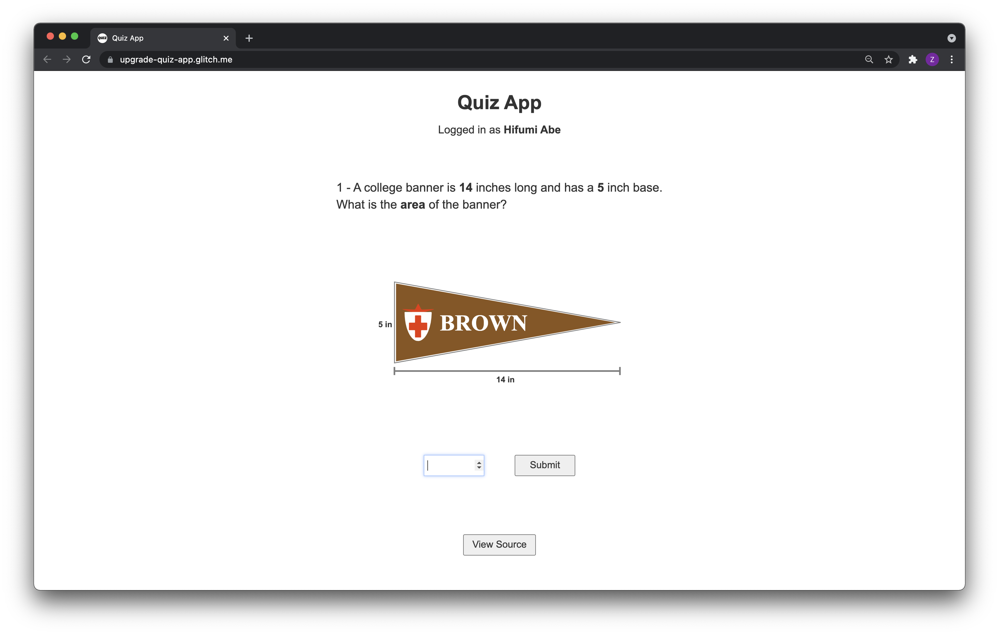

# Quiz App


## Description
A simple quiz app for the UpGrade demo app.

Here's the [Live Demo on Glitch](https://upgrade-quiz-app.glitch.me/).

The app currently randomly decides the question/motivational support type on page load. (Total 6 variations)


## Setup
1. Installation of node.js is required.
2. Run the following commands in the Terminal.
```
git clone https://github.com/CarnegieLearningWeb/quiz-app.git
cd quiz-app
npm install dependencies
npm start
```
3. Open your web browser and navigate to http://localhost:8080
